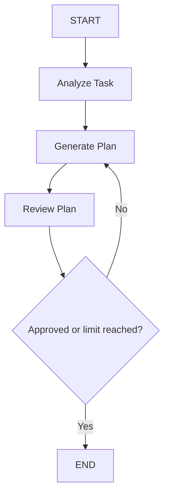

# Dev Task Agent


Um agente de terminal que transforma uma tarefa de desenvolvimento em um plano técnico revisado, usando uma LLM local.

## Objetivo

Projeto educacional e pequeno para estudar workflows de agentes com LangGraph: estado compartilhado, nodes, edges, decisões condicionais e ciclos controlados.

## Tecnologias

- Python 3.11+
- LangGraph
- LangChain (`langchain-ollama`)
- Ollama
- `gpt-oss:20b`

## Arquitetura



## Como funciona

O `AgentState` mantém tarefa, análise, plano, revisão e contador de tentativas. Cada **node** atualiza uma parte desse estado; **edges** definem a sequência. Após a revisão, uma **conditional edge** encerra um plano aprovado ou volta ao planejamento. O ciclo termina após duas revisões mesmo sem aprovação, evitando loop infinito.

## Estrutura do projeto

```text
dev-task-agent/
├── main.py            # interface de linha de comando
├── src/
│   ├── state.py       # AgentState (TypedDict) compartilhado entre os nodes
│   ├── nodes.py       # analyze_task, generate_plan, review_plan
│   ├── graph.py       # montagem do grafo e roteamento condicional
│   └── llm.py         # configuração do modelo no Ollama
└── tests/
    └── test_graph.py  # testes com LLM falsa (sem rede)
```

## Instalação

Crie e ative um ambiente virtual (opcional):

```bash
python -m venv .venv
source .venv/bin/activate  # Linux/macOS
```

No Windows:

```powershell
.venv\Scripts\activate
```

Instale as dependências:

```bash
pip install -r requirements.txt
```

Instale o [Ollama](https://ollama.com/download) separadamente e baixe o modelo (o projeto não faz isso automaticamente):

```bash
ollama pull gpt-oss:20b
```

Mantenha o servidor local do Ollama disponível.

## Executando

```bash
python main.py
```

## Testes

Os testes usam uma LLM falsa e não acessam o Ollama:

```bash
pytest
```

## Exemplo

```text
Descreva sua tarefa:
> Criar autenticação JWT usando FastAPI

Resultado
---------
Análise: Implementar autenticação para uma API FastAPI...
Plano: 1. Definir o fluxo de autenticação...
Status: APROVADO
Revisões realizadas: 1
```

## Aprendizados

O projeto demonstra gerenciamento de estado, criação de nodes e edges, conditional edges, ciclos com limite e integração entre LangGraph e uma LLM local.

## Autor

**Nathan Gobbi** — Desenvolvedor Python Jr.
